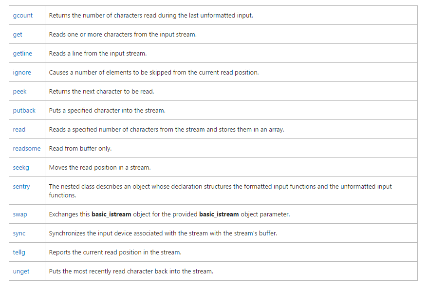

istream的成员函数：

# 字符（串）输入
## 直接使用操作符>>
```
#include <iostream>
#include <string>
using namespace std;
int main()
{
	string strName,strFamilyName;
	cout<<"input your name:";
	cin>>strName>>strFamilyName; 
	cout<<"hello,"<<strName<<","<<strFamilyName;
	return 0;
}
```
运行结果
```
d:\MFC2013\cppprimerplus\iostream>src.exe
input your name:Jonah Zeng
hello,Jonah,Zeng
```
显然地，操作符>>获取单个单词，遇到空格即停止并丢弃空格，并把剩下的输入仍然留在stream当中。

## get()函数
```
int_type get();
basic_istream<Elem, Tr>& get(Elem& _Ch);
basic_istream<Elem, Tr>& get(Elem *_Str,streamsize _Count);
basic_istream<Elem, Tr>& get(Elem *_Str,streamsize _Count,Elem _Delim);
```
第一个函数：
```
#include <iostream>
#include <string>
using namespace std;
int main()
{
	string strName,strFamilyName;
	cout<<"input your name:";
	char a=cin.get();
	cout<<a;
	return 0;
}
//运行结果
d:\MFC2013\cppprimerplus\iostream>src.exe
input your name:Jonah Zeng
J
```