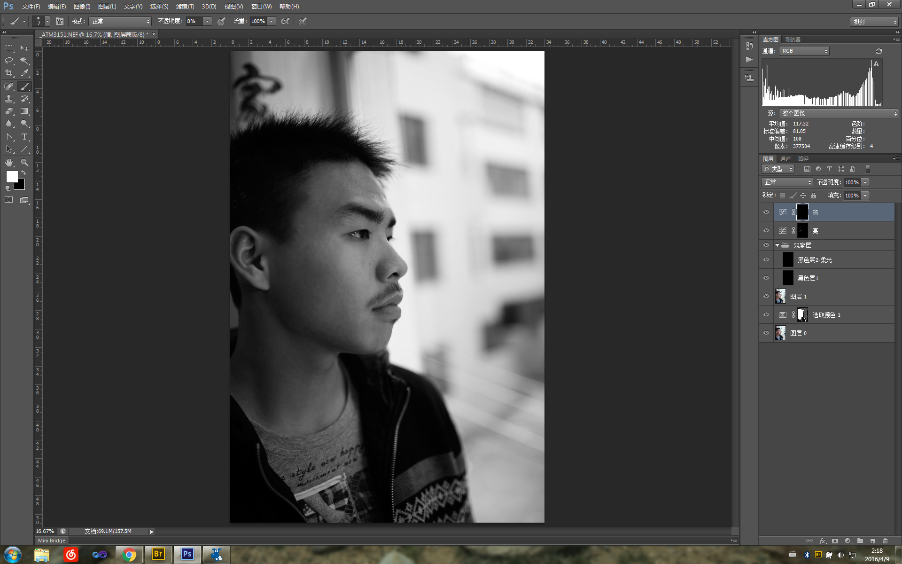

# 原理
使用加亮曲线+蒙版，针对性加亮皮肤上的暗斑亮度；
使用变暗曲线+蒙版，降低高光的亮度；
重点在与精确调整蒙版，很繁琐。
# 步骤

1. 调整肤色
2. 新建一层，填充黑色，使用颜色混合模式（即意味使用黑色层的颜色分量，使用下一层的明度分量合并）
3. 再新建一层，填充黑色，使用柔光混合模式把皮肤的杂质凸显出来；
4. 新建曲线调整层，拉亮，然后建立蒙版，使用黑色填充；
5. 新建曲线调整层，拉暗，建立蒙版，使用黑色填充；
6. 使用白色画笔，在两个曲线层的蒙版上精确控制即可