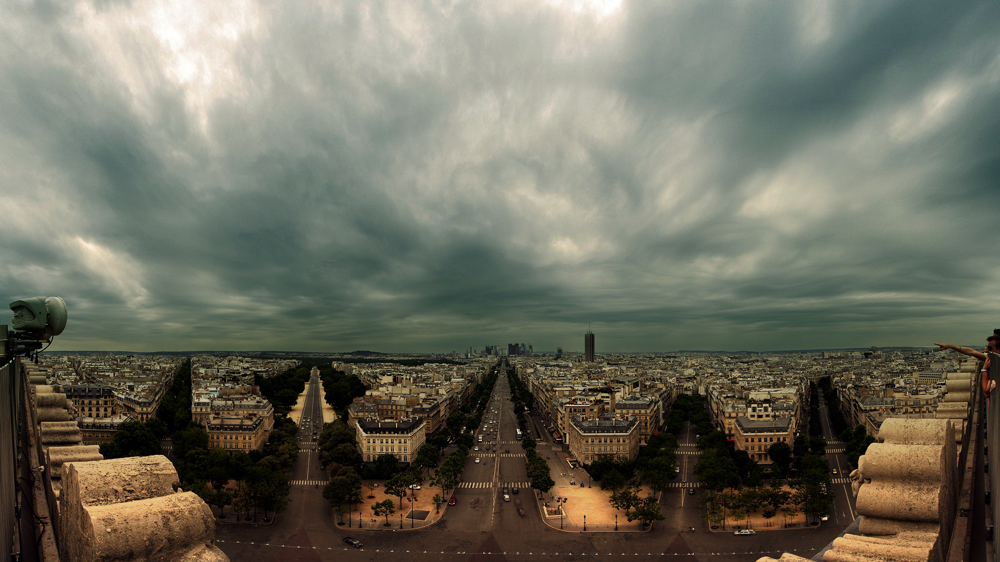
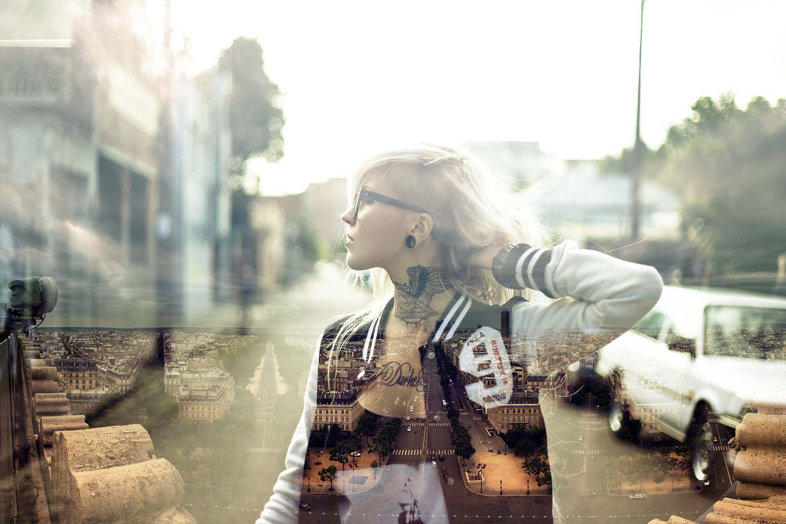

# **核心：滤色混合**
>滤色：查看每个通道的颜色信息，并将混合色的互补色与基础色复合，结果色总是较亮的颜色，用黑色过滤颜色保持不变，用白色过滤则产生白色，此效果类似多个幻灯片在彼此之上投影。
公式:结果色=255－[（255－基色）×（255－混合色）]/255

滤色混合的效果在于查看上一层的像素值，当上一层的颜色越接近0 时，结果更多是下一层的颜色，当上一层接近255时，显示更多是上一层颜色，当接近128时，得到比两层都亮的颜色。

# **图片分析**

我们把这两张图片当做两层，第一张的图片对比度很高，树荫房子和衣服的黑色将会把下一层显示，天空是白色，第一层颜色会保留。

