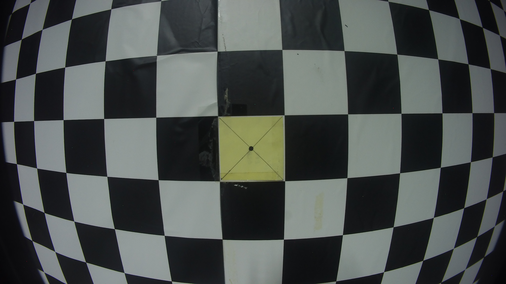
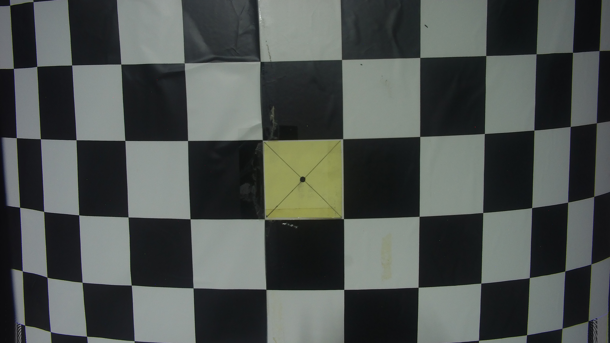
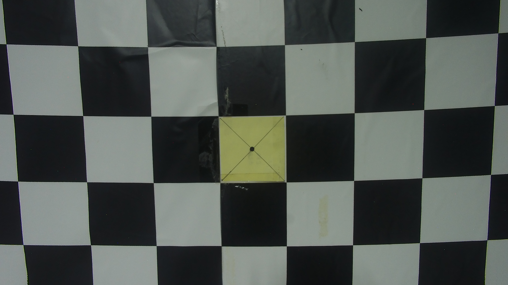
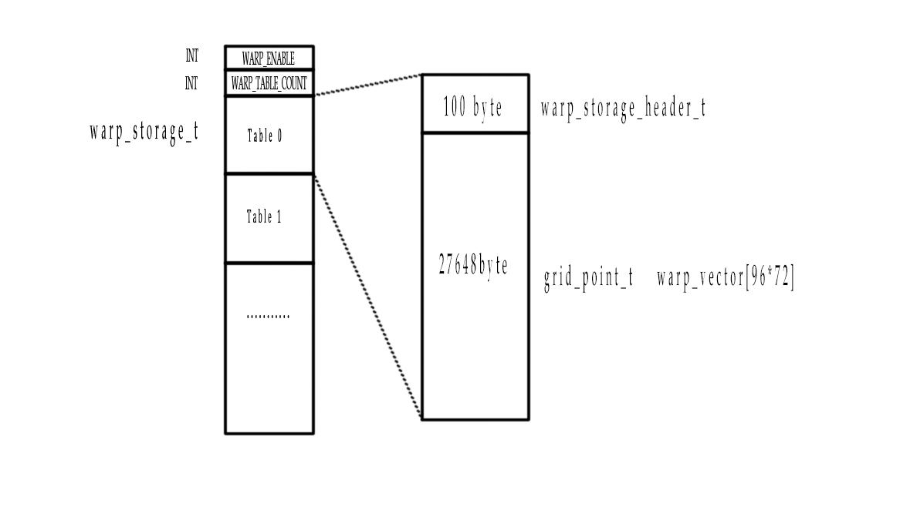

# dewarp的模式
---------
* IDEA_WARP ------理想模式
* SWA_XY_WARP -------super wide angel模式
所谓的理想模式，就是按照脚本指定的real expect来生成偏移量table，而SWA_XY_WARP则多加一步，为了保持水平视角，计算出理想的table之后，找到水平轴上的点的X偏移量，把这条轴上的X偏移置零，同时记下要置零前的偏移，把所有Tile的偏移减去对应的偏移；
## 效果对比




# calib6.bin的写入过程
-------------------------------
目前SDK没有完善多个table的写入，只写一个table.
```c
     	j = 0;
	 	index = 0;
		tmp = WARP_ENABLE;			ff_fwrite(&tmp, 4, 1, fid);		j+=4;//WARP_ENABLE                4
		tmp = COUNT_WARP_TABLE;			ff_fwrite(&tmp, 4, 1, fid);		j+=4;//WARP_TABLE_COUNT       8
	 	tmp = CAL_WARP_VER;	ff_fwrite(&tmp, 4, 1, fid);		j+=4;                                     12
		tmp = 1;			ff_fwrite(&tmp, 1, 1, fid);		j+=1;//WARP_TABLE_ENABLE                  13
		tmp = TILE_W;	ff_fwrite(&tmp, 1, 1, fid);		j+=1;                                         14
		tmp = TILE_H;	ff_fwrite(&tmp, 1, 1, fid);		j+=1;                                         15
		tmp = GRID_W;	ff_fwrite(&tmp, 1, 1, fid);		j+=1;                                         16
		tmp = GRID_H;	ff_fwrite(&tmp, 1, 1, fid);		j+=1;                                         17
		tmp = RESERVED1;	ff_fwrite(&tmp, 1, 1, fid);	j+=1;                                         18
		tmp = RESERVED2;	ff_fwrite(&tmp, 1, 1, fid);	j+=1;                                         19
		tmp = RESERVED3;	ff_fwrite(&tmp, 1, 1, fid);	j+=1;                                         20
		tmp = GEO_START_X;	ff_fwrite(&tmp, 4, 1, fid);	j+=4;                                         24
		tmp = GEO_START_Y;	ff_fwrite(&tmp, 4, 1, fid);	j+=4;                                         28
		tmp = IMG_W;	ff_fwrite(&tmp, 4, 1, fid);		j+=4;                                         32
		tmp = IMG_H;	ff_fwrite(&tmp, 4, 1, fid);			j+=4;                                     36
		tmp = GEO_DWNSMP;	ff_fwrite(&tmp, 4, 1, fid);	j+=4;                                         40
		tmp = MAX_X;	ff_fwrite(&tmp, 2, 1, fid);	j+=2;                                             42
		tmp = MAX_Y;	ff_fwrite(&tmp, 2, 1, fid);	j+=2;                                             44
		tmp = warp_zoom_step;	ff_fwrite(&tmp, 2, 1, fid);	j+=2;                                     46
        index = j - 8;
		for(i = 0; i < 100 - index; i++)                               //前108个字节写头信息以及填充0
		{
			tmp = 0;	
			ff_fwrite(&tmp, 1, 1, fid);//max_vector_y
			j++;
		}

		rval = ff_fwrite(mwwp, CAL_WARP_SIZE-j, 1, fid);      //#define CAL_WARP_SIZE (64*1024)
```		
# calib6.bin结构解析
------------------------
```c
     typedef struct warp_control_s {
    	int enable;
    	int warp_table_count;
        warp_storage_t *warp_table[MAX_WARP_TABLE_COUNT];    //5  MAX
      } warp_control_t;
      
      typedef struct warp_storage_s {
	     // 100 byte header
	    warp_storage_header_t warp_header;
  	      //one table size :27648 bytes (max)
     	grid_point_t warp_vector[WARP_MAX_SIZE]; // WARP vectors     96*72  MAX
     } warp_storage_t;
     
     typedef union {
	   warp_header_t content;
	   char bytes[100];
     } warp_storage_header_t;
     
     typedef struct grid_point_s
     {
	   s16 x;
	   s16 y;
     } grid_point_t;
```
     

# 手动合并多个table
如下是合并2个table到calib6.bin的sample code:
```c
#include <stdio.h>
#include <string.h>
#include <stdlib.h>
#define MAX_WARP_TABLE_COUNT (2)
#define s16 short
#define u32 int
#define u8 unsigned char
#define u16 unsigned short
#define WARP_MAX_WIDTH  (96)
#define WARP_MAX_HEIGHT (72)
#define WARP_MAX_SIZE (WARP_MAX_WIDTH*WARP_MAX_HEIGHT) 

typedef  struct warp_geo_info_s {
	u32     start_x;        // The location in sensor of output pixel (0, 0)
	u32     start_y;
	u32     width;
	u32     height;
	u32     downsample;     // 1, 2, 4	
}  warp_geo_info_t;

typedef struct warp_header_s {
	u32 magic_num;
	u8  enable;
	u8  tile_size_h; // 0 for 64 and 1 for 128
	u8  tile_size_v; // 0 for 64 and 1 for 128
	u8  num_tiles_horizontal;
	u8  num_tiles_vertical;
	u8  padd[3];
	warp_geo_info_t swin_info;
	u16 max_vector_x;  // max absolute value of horizontal warp vector
	u16 max_vector_y;  // max absolute value of vertical warp vector
	u16 warp_zp_step;
} warp_header_t;

typedef union {
	warp_header_t content;
	char bytes[100];
} warp_storage_header_t;


typedef struct grid_point_s
{
	s16 x;
	s16 y;
} grid_point_t;


typedef struct warp_storage_s {
	// 100 byte header
	warp_storage_header_t warp_header;
	//one table size :27648 bytes (max)
	grid_point_t warp_vector[WARP_MAX_SIZE]; // WARP vectors
} warp_storage_t;

typedef struct warp_control_s {
	int enable;
	int warp_table_count;
	warp_storage_t *warp_table[MAX_WARP_TABLE_COUNT];
} warp_control_t;


int main()
{
	warp_storage_t buff1,buff2;
	FILE* keep_view_calib6_F;
	FILE* nokeep_view_calib6_F;
	FILE* new_calib6_F;
	int warpEnable = 1;
	int warp_table_count = 2;
	char buff3[10032];

	memset(buff3,0,10032);

	char* table1 = "D:\\MFC2013\\combainCalib6\\calib6_1_keepview.bin";
	char* table2 = "D:\\MFC2013\\combainCalib6\\calib6_2_nokeepview.bin";

	keep_view_calib6_F = fopen(table1,"r+b");
	nokeep_view_calib6_F = fopen(table2, "r+b");

	
	if (keep_view_calib6_F == NULL || nokeep_view_calib6_F == NULL)
	{
		printf("open file error !");
		system("pause");
		return -1;
	}

	fseek(keep_view_calib6_F,8,SEEK_SET);
	fseek(nokeep_view_calib6_F, 8, SEEK_SET);

	fread(&buff1, sizeof(warp_storage_t), 1, keep_view_calib6_F);
	fread(&buff2, sizeof(warp_storage_t), 1, nokeep_view_calib6_F);

	fclose(keep_view_calib6_F);
	fclose(nokeep_view_calib6_F);

	new_calib6_F=fopen("calib6.bin","w+b");
	fwrite(&warpEnable,4,1,new_calib6_F);
	fwrite(&warp_table_count,4,1,new_calib6_F);
	fwrite(&buff1, sizeof(warp_storage_t), 1, new_calib6_F);
	fwrite(&buff2, sizeof(warp_storage_t), 1, new_calib6_F);
	fwrite(buff3, 10032, 1, new_calib6_F);
	fclose(new_calib6_F);

	system("pause");
	return 0;
}
```
# calib6.bin的读取过程
```c
    int app_pre_init(void)
    {
       .......
       app_calib_load_data(0);     //读取第一个table
       .......
    }
    
    int app_init(void)
    {
      .....
       app_calib_load_data(1);     //用第一个table初始化
      .....
    }
    
     void bootmgr_task(VP_INT exinf)
     {
     	......
     	app_calib_load_data(2);       //追加读取其他table
        ....... 
     }
    
    int app_calib_load_data(int stage)
    {
    	switch (stage) 
    	{
    	case 0:
    		calib_init_stage0();
    		break;
    	case 1:
    		calib_init_stage1();
    		break;
    	case 2:
    		calib_init_stage2();
    		break;
    	case 3:
    		calib_init_stage3();
    		break;
    	case 4:
    		calib_init_stage4();
    		break;
    	default:
    		rvct_20_check;
    		break;
    	}
    	return 0;
    }
    
    void calib_init_stage0(void)
    {
    	......
    	calib_init(CAL_WARP_ID,CALIB_LOAD,FULL_LOAD);
        ......
    }
    
    void calib_init_stage2(void)
    {
       ......
       calib_init(CAL_WARP_ID,CALIB_POST_LOAD,FULL_LOAD);
       .....
    }
    
    int calib_init(u32 cal_id,u8 job_id, u32 partial_id)
    {
       ......
       if(job_id == CALIB_LOAD)
       {
          calib_partial_load_rom(cal_obj, cal_id, CALIB_TABLE_IDX_INIT, CALIB_TABLE_COUNT_INIT, CALIB_LOAD);
       }
       else if(job_id == CALIB_POST_LOAD)
       {
          calib_partial_load_rom(cal_obj, cal_id, CALIB_TABLE_IDX_POST, CALIB_TABLE_COUNT_POST, CALIB_POST_LOAD);
       }
       //如果想要追加读取，此时必须修改 CALIB_TABLE_IDX_POST这个宏，必须定义为1
       ......
    }
    
    int calib_partial_load_rom(cal_obj_t *cal_obj, u32 cal_id, u8 table_idx, u8 table_count, u8 post_load)
    {
      ......
      if (post_load == CALIB_POST_LOAD)//100  追加读取其他table
		    {
			  table_count = *(cal_addr+table_count_addr)- table_idx;   //此时读取多少个table不由参数指定，由calib6.bin存储的值table_conut决定，一次读完剩下所有的table
			  cal_addr += table_base;   //跳过  enable  table_count   8个字节
		    }
		..........
		else 
			{
 			  cal_addr += table_base;
		    } 
		if (table_idx > 0) //追加读取，table_idx必须大于0
			{
			  ff_fseek(fid, table_base + vector_size*table_idx, FF_SEEK_SET);  //FSEEK
			  cal_addr += vector_size*table_idx;                               //内存地址相应的增加，以免覆盖第一个table
		    }

		if (table_count > 0)
			rval = ff_fread(cal_addr, 1, vector_size*table_count, fid);			
		else
			return -1;
      ......
    }
```   
# 结论

总之，如果想要追加读取，必须修改 `CALIB_TABLE_IDX_POST`这个宏，必须定义为大于等于1。`CALIB_TABLE_COUNT_POST`这个参数没用。相应的在calib6.bin里写入的table_count必须大于等于2。

关键一步：`calib_partial_load_rom(cal_obj, cal_id, CALIB_TABLE_IDX_POST, CALIB_TABLE_COUNT_POST, CALIB_POST_LOAD);`

**初始化使用第一个table千万不要改动**，因为初始化的时候还没有追加读取其他table到内存。
```c
     int cal_init_warp(cal_obj_t *cal_obj)
     {
     	int i;
     	u8 *warp_addr = cal_obj->dram_shadow;
     	static u8 warp_init_flag = 0;
     
     	if(warp_init_flag == 0)
     	{
     		memset(&app_warp_control,0,sizeof(warp_control_t));
     		warp_init_flag = 1;
     	}
     	app_warp_control.enable = get_int(&warp_addr[CAL_WARP_ENABLE]);
     	printk("cal_init_warp.enable %d",app_warp_control.enable);
     	if (app_warp_control.enable) 
     	{
     		app_warp_control.warp_table_count = get_int(&warp_addr[CAL_WARP_TABLE_COUNT]);
     		for (i=0; i < MAX_WARP_TABLE_COUNT; i++)
     			app_warp_control.warp_table[i] = &warp_addr[CAL_WARP_TABLE(i)];
     		if (app_warp_control.warp_table[0]->warp_header.content.enable)   //使用第一个table
     		{
     			app_select_warp_table(1, 0, 0, 0x10000, 0);
     		}
     	}
     	return 0;
     }
```    
完成初始化后可以使用`app_select_warp_table(int enable, int id_1, int id_2, int blend_ratio, int decay_ratio)`来动态调整使用哪个table表。