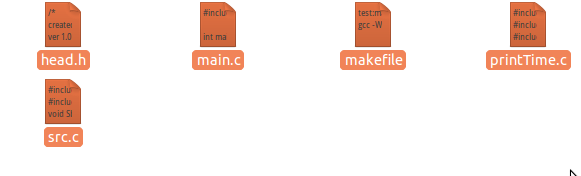

# linux入门
1. 纯文本登陆界面：ctrl+alt+F1-F6 ctrl+alt+f7返回GUI界面（ubuntu的GUI是GNOME）
2. 关机：shutdown -h now /poweroff/halt
3. 重启：shutdown -r now/reboot
4. 关于app安装与卸载，sudo apt-get install xxxx----安装；sudo apt-get remove xxxx  -------卸载app;sudo apt-get remove --purge xxxx卸载app并且删除配置文件
5. 杀进程，ps -e显示所有进程，ps -e|grep firefox显示firefox进程号，kill即可
# 配置共享文件夹
1. virtualbox->设备->安装增强功能
2. 开始编译，一定要把support share folder模块编译成功
3. 成功以后 设备->共享文件夹->指定一个windows文件夹
4. 在ubuntu挂载：挂载共享文件夹
5. 进入虚拟Ubuntu，在命令行终端下输入：
sudo mkdir /mnt/shared
sudo mount -t vboxsf share /mnt/shared
其中"share"是之前创建的共享文件夹的名字。OK，现在Ubuntu和主机可以互传文件了。
要想自动挂载的话，可以在/etc/fstab中添加一项
share /mnt/shared vboxsf rw,gid=100,uid=1000,auto 0 0
6. 卸载的话使用下面的命令：
sudo umount -f /mnt/shared

# ARM交叉编译器支持
由于安装的ubuntu是64位，交叉编译器是32位，运行起来缺少32位库文件，解决办法：
sudo apt-get install lib32ncurses5
sudo apt-get install lib32ncurses5-dev
在/usr/include/目录下就有了/sys目录

# 配置samba服务
[请看这里](http://jingyan.baidu.com/article/00a07f38b9194082d028dc08.html)

# gcc编译器选项
-E 预处理，但不编译，不汇编，不链接，
-S 汇编，生成.s文件
-c 编译，但不链接，生成.o文件
-o < file> 编译并且链接可执行文件，< file>指定目标名
比如gcc -o exe main.c ,那么exe就是最终的执行文件

# gdb使用方法
* 首先在编译的时候加上-g选项：gcc src.c -g -o exe
* gdb main
* gdb list   ----打印源代码
1. gdb list < lineNumber>  ----打印某一行代码
2. gdb list < func>    --------打印某个函数代码
* gdb start  -----开始调试，走到main函数第一行 
* gdb next ----逐语句执行
* gdb step  -----逐过程执行
* gdb backtrace  -----打印所有的栈帧，比如main函数以及它调用的函数
* gdb frame  < 1>   -----选择一个栈帧
* gdb info locals < 1>   ------打印这个栈帧的局部变量
* gdb print < var>      -------打印某个变量的值
* gdb finish     --------直接运行到结束
* gdb set var  < var=?>   -----设置变量值
* gdb display < var>    -----每次命令停止的时候都打印某个变量的值
* gdb undisplay  < 编号>   ----取消追踪某个变量  用编号表示这个变量
* gdb break < 行号或者函数名>   -----设置断点
* gdb continue     --------直接运行，直到碰到断点
* gdb info breakpoint   --------显示所有的断点和编号
* gdb delete breakpoint < i>   -----删除指定断点
# makefile编写规则
实例：

我这里有3个c文件和一个h文件
makefile(原始版本) sample code:
```makefile
#第一个目标文件一定要是最终目标（可执行文件）
test:main.o src.o printTime.o
	gcc -Wall  -o test printTime.o main.o src.o 

printTime.o:printTime.c head.h
	gcc -Wall -c printTime.c
src.o:src.c head.h
	gcc -Wall -c src.c

main.o:main.c head.h
	gcc -Wall -c main.c

#声明伪目标用于make clean
.PHONY: clean
clean:
	@echo clean start !
	rm -f test main.o src.o printTime.o
	@echo clean completed !
```
改一下，把o文件的依赖关系提取并分离：
```makefile
test:main.o src.o printTime.o
	gcc -Wall  -o test printTime.o main.o src.o 
#分离依赖关系
printTime.o:head.h
printTime.o:printTime.c
	gcc -Wall -c printTime.c
#分离依赖关系
src.o:head.h
src.o:src.c
	gcc -Wall -c src.c
#分离依赖关系
main.o:head.h
main.o:main.c 
	gcc -Wall -c main.c


.PHONY: clean
clean:
	@echo clean start !
	rm -f test main.o src.o printTime.o
	@echo clean completed !
```
利用make的隐含规则精简`%.o:%.c`
```makefile
test:main.o src.o printTime.o
	gcc -Wall  -o test printTime.o main.o src.o 

printTime.o:head.h
#printTime.o:printTime.c
#gcc -Wall -c printTime.c
src.o:head.h
#src.o:src.c
#gcc -Wall -c src.c

main.o:head.h
#main.o:main.c 
#gcc -Wall -c main.c


.PHONY: clean
clean:
	@echo clean start !
	rm -f test *.o
	@echo clean completed 
```
当make工具展开依赖关系的时候，发现，main.o src.o printTime.o都没有对应的.c文件来依赖，这个时候开始查找make工具的内置隐含规则：%.o:%.c
关于make的隐含规则，如下是命令make -p >rule.txt中找到的：
```makefile
%.o: %.c
	$(COMPILE.c) $(OUTPUT_OPTION) $<
#展开,CFLAGS，CPPFLAGS，TARGET_ARCH都没有定义
COMPILE.c = $(CC) $(CFLAGS) $(CPPFLAGS) $(TARGET_ARCH) -c
CC=cc
# 默认
OUTPUT_OPTION = -o $@
```
在linux上，cc是指向/usr/bin/gcc的链接符号，可以使用which cc查看到是指向/usr/bin/cc，接着ls -l /usr/bin/cc可以看到跳转到另一个文件，一直追下去，最终指向/usr/bin/gcc，到这里就很明显了，举个例子，上面的main.o，当发现没有.c依赖的时候，启用内建规则%.o:%.c变成：
```makefile
main.o:main.c
    cc -c -o $@ $<
```
\$@是当前依赖规则的目标也就是main.o，\$<是当前依赖规则的第一个条件就是main.c,于是这条命令就完成了：
```makefile
main.o:main.c
    cc -c -o main.o main.c
```
## makefile中的变量与符号
首先来看2个例子：
```makefile
all:
	@echo $(y)
y:=$(x) bar
x=foo
```
```
all:
	@echo $(y)
y=$(x) bar
x=foo
```
第一个例子，make命令的结果是 bar，第二个例子的结果是foo bar。为什么会这样子？因为:=和=展开发生的时间点不同。

* makefile的运行分为俩个阶段，第一阶段读取整个makefile建立完整的依赖关系。第二阶段根据依赖关系执行编译命令。
* 使用=的变量，在第一阶段并不会立即展开，而是在第二阶段，所以这样的变量可以读取到再它定义位置后面的嵌套定义。
* 使用:=的变量，在第一阶段的时候一旦定义则立即展开，所以如果有定义在它后面的嵌套定义，则不会生效。
|符号|意义    |
|:----:|:-------:|
|=|变量定义，在第二阶段展开|
|:=|变量定义，第一阶段读取到定义后，立即展开|
|?=|如果已经定义，则保持不变，否则定义这个变量，作用和=一样|
|+=|给变量追加，类似与C++字符串的+=，但是makefile里会自动在前面添加一个空格，+=保持=/:=的性质|
|\$@|当前规则的目标文件名|
|\$<|当前规则的第一个条件文件名|
|\$?|当前规则中所有比目标新的条件，组成一个列表，用空格分隔|
|\$^|当前规则中的所有条件，同样组成一个列表，用空格分隔，如果有重复，则将重复项删除|
### 约定俗成的定义
从之前的例子里可以看到，make工具本身内置了一些定义，这些定义通常是约定好了的
|定义|值|
|:----:|:------:|
|AR|静态库打包程序，默认为ar|
|ARFLAGS|静态库打包命令选项，默认为rv|
|AS|汇编程序，默认为as|
|ASFLAGS|汇编选项，默认为空|
|CC|c编译器，默认值是cc|
|CFLAGS|c编译选项，默认为空|
|CXX|C++编译器，默认为g++|
|CXXFLAGS|C++编译选项，默认为空|
|CPP|c预处理，默认是$(CC) -E|
|CPPFLAGS|c预处理选项，默认为空|
|LD|链接器，默认为ld|
|LDFLAGS|链接选项，默认为空|
|TARGET_ARCH|平台相关的命令行选项，默认为空|
|OUTPUT_OPTION|输出的命令行选项，默认为-o \$@|
|LINK.o|LINK.o = \$(CC) \$(LDFLAGS) \$(TARGET_ARCH)|
|LINK.c|LINK.c = \$(CC) \$(CFLAGS) \$(CPPFLAGS) \$(LDFLAGS) \$(TARGET_ARCH)|
|LINK.cc|LINK.cc = \$(CXX) \$(CXXFLAGS) \$(CPPFLAGS) \$(LDFLAGS) \$(TARGET_ARCH)|
|COMPILE.c|COMPILE.c = \$(CC) \$(CFLAGS) \$(CPPFLAGS) \$(TARGET_ARCH) -c|
|COMPILE.cc|COMPILE.cc = \$(CXX) \$(CXXFLAGS) \$(CPPFLAGS) \$(TARGET_ARCH) -c|
|RM|rm -f|
## 自动处理头文件依赖关系
经过以上处理后，现在makefile变成了这样：
```makefile
all: test
test:main.o src.o printTime.o
	$(CC) -o $@ $^ 

printTime.o:head.h
src.o:head.h
main.o:head.h

.PHONY: clean
clean:
	@echo clean start !
	@rm -f test *.o
	@echo clean completed !
```
如何自动处理头文件依赖关系呢？使用gcc -M main.c可以查看所有的头文件依赖，包括系统头文件，gcc -MM main.c则只显示非系统头文件依赖关系。官方手册推荐写法如下：
```makefile

all: test

test:main.o src.o printTime.o
	$(CC) -o $@ $^ 

sources=main.c src.c printTime.c

include $(sources:.c=.d)

%.d:%.c
	set -e;rm -f $@;\
	$(CC) -MM $(CPPFLAGS) $< > $@.$$$$;\
	sed 's,\($*\)\.o[ :]*,$*\.o $@ : ,g' < $@.$$$$ > $@;\
	rm -f $@.$$$$

.PHONY: clean
clean:
	@echo clean start !
	@rm -f test *.o
	@echo clean completed !
```
