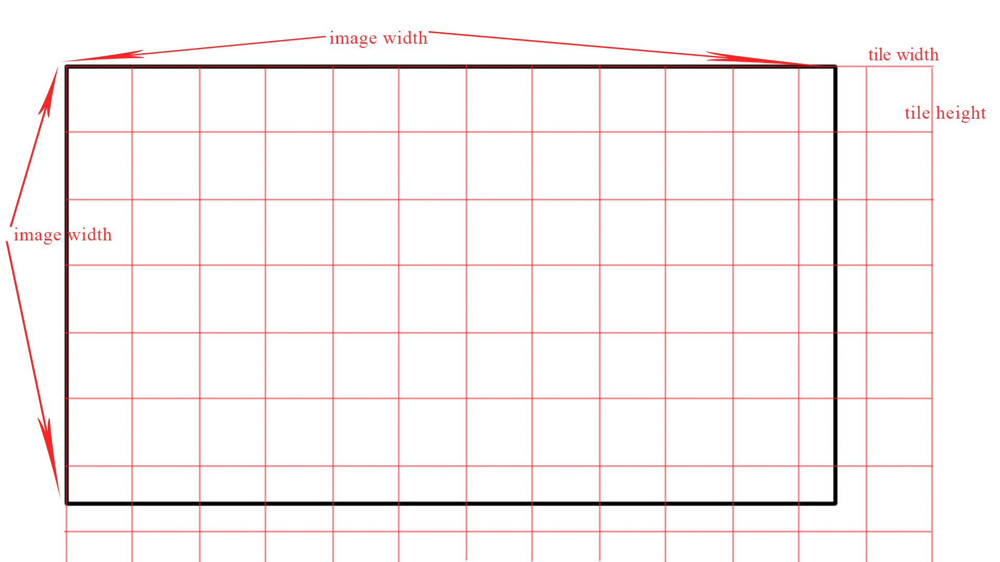

# A12如何保存加载dewarp LUT以及相关的函数与结构
对于常规镜头来说，给出镜头的畸变参数（实际测量距离，理论距离），写成一个脚本，就可以通过函数 `AppLibCalibWarp_GenWarpFromSpec(int Argc, char *Argv[])`来计算dewarp的查找表，A12存储查找表放在calib6.bin文件，然后开机初始化从这个文件加载参数。以下是calib6.bin的写入方式(对于定焦镜头来说，只写一个table就足够了)：
```c
    Tmp = WARP_ENABLE;          AmbaFS_fwrite(&Tmp, 4, 1, Fid);     J+=4;//WARP_ENABLE
    Tmp = COUNT_WARP_TABLE;     AmbaFS_fwrite(&Tmp, 4, 1, Fid);     J+=4;//WARP_TABLE_COUNT
    Tmp = RESERVED1;            AmbaFS_fwrite(&Tmp, 4, 1, Fid);     J+=4;//Reserve[0]
    Tmp = RESERVED1;            AmbaFS_fwrite(&Tmp, 4, 1, Fid);     J+=4;//Reserve[1]
    Tmp = RESERVED1;            AmbaFS_fwrite(&Tmp, 4, 1, Fid);     J+=4;//Reserve[2]
    Tmp = RESERVED1;            AmbaFS_fwrite(&Tmp, 4, 1, Fid);     J+=4;//Reserve[3]
    Tmp = RESERVED1;            AmbaFS_fwrite(&Tmp, 4, 1, Fid);     J+=4;//Reserve[4]
    Tmp = RESERVED1;            AmbaFS_fwrite(&Tmp, 4, 1, Fid);     J+=4;//Reserve[5]
    Tmp = 1;                    AmbaFS_fwrite(&Tmp, 4, 1, Fid);     J+=4;//Warp table enable
    Tmp = CAL_WARP_VER;         AmbaFS_fwrite(&Tmp, 4, 1, Fid);     J+=4;//WARP version
    Tmp = ToolInfo.Tile.HorGridNum;          AmbaFS_fwrite(&Tmp, 4, 1, Fid);     J+=4;// Horizontal grid number
    Tmp = ToolInfo.Tile.VerGridNum;          AmbaFS_fwrite(&Tmp, 4, 1, Fid);     J+=4;//Vertical grid number
    Tmp = TileWidthExp;         AmbaFS_fwrite(&Tmp, 4, 1, Fid);     J+=4;// 4:16, 5:32, 6:64, 7:128, 8:256, 9:512
    Tmp = TileHeightExp;        AmbaFS_fwrite(&Tmp, 4, 1, Fid);     J+=4;// 4:16, 5:32, 6:64, 7:128, 8:256, 9:512
    Tmp = StartX;               AmbaFS_fwrite(&Tmp, 4, 1, Fid);     J+=4;// StartX
    Tmp = StartY;               AmbaFS_fwrite(&Tmp, 4, 1, Fid);     J+=4;// StartY
    Tmp = ToolInfo.CAL.ImgWidth;                AmbaFS_fwrite(&Tmp, 4, 1, Fid);     J+=4;// ImgWidth
    Tmp = ToolInfo.CAL.ImgHeight;           AmbaFS_fwrite(&Tmp, 4, 1, Fid);     J+=4;// ImgHeight
    Tmp = HSubSampleFactorNum;  AmbaFS_fwrite(&Tmp, 1, 1, Fid);     J+=1;// HSubSampleFactorNum
    Tmp = HSubSampleFactorDen;  AmbaFS_fwrite(&Tmp, 1, 1, Fid);     J+=1;// HSubSampleFactorDen
    Tmp = VSubSampleFactorNum;  AmbaFS_fwrite(&Tmp, 1, 1, Fid);     J+=1;// VSubSampleFactorNum
    Tmp = VSubSampleFactorDen;  AmbaFS_fwrite(&Tmp, 1, 1, Fid);     J+=1;// VSubSampleFactorDen
    Tmp = ToolInfo.Warp2StageFlag;AmbaFS_fwrite(&Tmp, 4, 1, Fid);   J+=4;// ToolInfo.Warp2StageFlag
    Tmp = RESERVED2;            AmbaFS_fwrite(&Tmp, 4, 1, Fid);     J+=4;// Reserved2
    Tmp = RESERVED3;            AmbaFS_fwrite(&Tmp, 4, 1, Fid);     J+=4;// Reserved3
    Tmp = WarpZoomStep;         AmbaFS_fwrite(&Tmp, 4, 1, Fid);     J+=4;// WarpZoomStep
    Tmp = WarpChannel;          AmbaFS_fwrite(&Tmp, 4, 1, Fid);     J+=4;// WarpChannel

    Rval = AmbaFS_fwrite(ToolInfo.MwWp, CAL_WARP_SIZE-(sizeof(Warp_Storage_Header_s)+32), 1, Fid);
```
## calib6.bin的结构
|占用字节|内容|
|--------|----|
|4       |WARP_ENABLE|
|4       |WARP_TALBE_COUNT|
|24      |reserved|
|sizeof (Warp_Storage_s)|table 0|
|sizeof (Warp_Storage_s)|table 1|
|sizeof (Warp_Storage_s)|...... |
最多存储4个table。
```c
typedef struct Warp_Storage_s_ {
    Warp_Storage_Header_s WarpHeader;    /**< Warp Storage Header */
    //6KB for x,y each = 12KB
    AMBA_DSP_IMG_GRID_POINT_s WarpVector[WARP_MAX_SIZE]; /**< Warp vectors */
} Warp_Storage_s;

typedef __packed struct Warp_Storage_Header_s_ {            //64 bytes
    UINT32                              Enable;            /**< Function Enable control*/
    UINT32                              Version;        /* 0x20130101 */ /**< Structure Version */
    int                                 HorGridNum;     /**< Horizontal grid number */
    int                                 VerGridNum;     /**< Vertical grid number */
    int                                 TileWidthExp;   /**< Exponent of Tile Width. 4:16, 5:32, 6:64, 7:128, 8:256, 9:512 */
    int                                 TileHeightExp;  /**< Exponent of Tile Height. 4:16, 5:32, 6:64, 7:128, 8:256, 9:512 */
    AMBA_DSP_IMG_VIN_SENSOR_GEOMETRY_s  VinSensorGeo;   /**< Vin sensor geometry when calibrating */
    UINT32                              Warp2StageFlag; /**< warp 2 stage compensation */
    UINT32                              Reserved1;      /**< Reserved for extension */
    UINT32                              Reserved2;      /**< Reserved for extension */
    UINT32                              WarpZoomStep;   /**< zoom step number */
    UINT32                              WarpChannel;    /**< channel ID */
} Warp_Storage_Header_s;

typedef struct _AMBA_DSP_IMG_GRID_POINT_s_ {
    INT16   X;
    INT16   Y;     //注意：这里的值是偏移量（pixel）乘以16
} AMBA_DSP_IMG_GRID_POINT_s;
```
dewarp的查找表就在：`AMBA_DSP_IMG_GRID_POINT_s WarpVector[WARP_MAX_SIZE]; `具体元素有多少个，根据tileWidth,tileHeight可以算出来：

```c
ToolInfo.Tile.HorGridNum = (ToolInfo.CAL.ImgWidth+ToolInfo.Tile.TileWidth-1)/ToolInfo.Tile.TileWidth + 1 ; ToolInfo.Tile.VerGridNum = (ToolInfo.CAL.ImgHeight+ToolInfo.Tile.TileHeight-1)/ToolInfo.Tile.TileHeight+ 1 ;
```


##开机初始化dewarp参数

```c
int AppLibCalibWarp_Init(Cal_Obj_s *CalObj)
{
    int i;
    UINT8 *WarpAddress = CalObj->DramShadow;   //calib6.bin被加载到DRAM后的地址
    static UINT8 WarpInitFlag = 0;

    if (WarpInitFlag == 0) 
    {
        memset(&AppWarpControl,0,sizeof(Warp_Control_s));
        WarpInitFlag = 1;
    }
    AppWarpControl.Enable = (UINT32)WarpAddress[CAL_WARP_ENABLE];//首先读取使能
  
    CAL_PRINT("AppWarpControl.Enable %d",AppWarpControl.Enable);


    if (AppWarpControl.Enable == 1) 
	{
        AppWarpControl.WarpTableCount = (UINT32)WarpAddress[CAL_WARP_TABLE_COUNT];  //读取存储的table个数
      
        for (i=0; i < MAX_WARP_TABLE_COUNT; i++)
		{
            AppWarpControl.WarpTable[i] = (Warp_Storage_s*)&WarpAddress[CAL_WARP_TABLE(i)];   //指针指向Warp_Storage_s也就是table 0/1/2....

        }
        for(i=0; i<AppLib_CalibGetVinChannelNumber(); i++) 
		{
            if (AppWarpControl.WarpTable[i]->WarpHeader.Enable == 1) //table里的使能是开的
			{
                AppLibCalibWarp_SelectWarpTable(1, i, 0, 0, 0, 65536);    //打开dewarp
            } 
			else 
			{
                AppLibCalibWarp_SelectWarpTable(0, i, 0, 0, 0, 65536);    //否则关闭dewarp
            }
        }
        CAL_PRINT("version: 0x%x",AppWarpControl.WarpTable[0]->WarpHeader.Version);
    } 
	else 
	{
        for(i=0; i<AppLib_CalibGetVinChannelNumber(); i++) 
		{
            AppLibCalibWarp_SelectWarpTable(0, i, 0, 0, 0, 65536);
        }
    }

    return 0;
}

```
关于函数`AppLibCalibWarp_SelectWarpTable`，它有几个功能：开关dewarp，改变dewarp的校正强度，在不同的table之间切换。函数很简单，可自行分析；

#注意
因为是鱼眼镜头，不同于普通镜头，这个查找表需要按照安霸的结构自行填写，然后修改初始化过程。