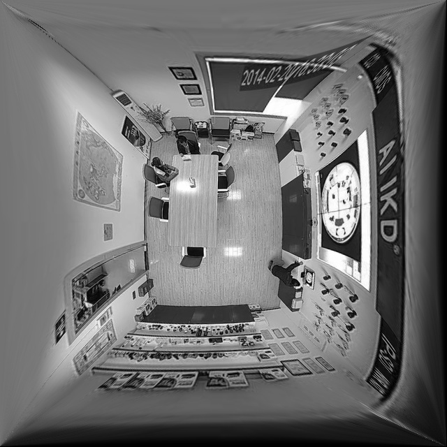

# theory
[基于双经度模型的鱼眼图像畸变矫正方法](http://wenku.baidu.com/link?url=OgVsC2m6-VrvePrQjCdOKd3U1w_54rwqakm_FOMezDw9Kn63CvY5tMw_HxrFC69GDw72QGtgs1-uXhfTqKxxuJLmRBBvg4x_JTgNOBzoBqO)
原文最后的结论公式笔误，没有注意符号问题
# code
note:

* 使用的是**opencv3.0.0**
* 强制规定图片长度和宽度相等
* 偷懒转成了黑白
* 偷懒没有准确确定圆心
```c++
#include <iostream>
#include <cmath>
#include <opencv2\opencv.hpp>
#define ENABLE_DEBUG
#define SAVE_OUTPUT 
using namespace std;
using namespace cv;

int main(int argc,char* argv[])
{
	cout << "==========user guide ==============" << endl;
	cout << "1, argument count number should be 2 ,for example: fisheye.exe default.jpg" << endl;
	cout << "   in this case ,\"default.jpg\" will be opened ." << endl;
	cout << "2, width of input image must == height" << endl;
	cout << "============= end =================" << endl;
	assert(argc == 2);
	Mat InputMat = imread(argv[1]);
	if (InputMat.type() == CV_8UC3)
	{
		//不要问为什么转黑白，我偷懒我愿意
		cvtColor(InputMat, InputMat, CV_BGR2GRAY);
	}
	assert(InputMat.type()==CV_8UC1&&InputMat.cols==InputMat.rows);
#ifdef ENABLE_DEBUG
	namedWindow("display input", CV_WINDOW_AUTOSIZE);
	imshow("display input", InputMat);
#endif
#ifdef SAVE_OUTPUT
	imwrite("input.jpg", InputMat);
#endif 


	const double PI = 3.14159;
	const int R = InputMat.cols/2;
	int centerX = InputMat.cols / 2, centerY = InputMat.cols / 2;
	double LongitudeX = 0, LongitudeY = 0;
	int outputCoordinateX = 0, outputCoordinateY = 0;
	float inputCoordinateX = 0, inputCoordinateY = 0;
	int flag1 = 0, flag2 = 0;

	Mat map1,map2,outputMat;
	map1.create(InputMat.size(), CV_32FC1);
	map2.create(InputMat.size(), CV_32FC1);
	outputMat.create(InputMat.size(), CV_8UC1);

	for (outputCoordinateY = 1; outputCoordinateY <= InputMat.rows; outputCoordinateY++)
	{
		float* pMap1 = map1.ptr<float>(outputCoordinateY - 1);
		float* pMap2 = map2.ptr<float>(outputCoordinateY - 1);
		for (outputCoordinateX = 1; outputCoordinateX <= InputMat.cols; outputCoordinateX++)
		{
			LongitudeX = PI - (PI / InputMat.cols)*outputCoordinateX;
			LongitudeY = PI - (PI / InputMat.cols)*outputCoordinateY;
			if (LongitudeX > PI / 2)
				flag1 = -1;
			else
				flag1 = 1;
			if (LongitudeY > PI / 2)
				flag2 = -1;
			else
				flag2 = 1;
			double tanX = tan(LongitudeX);
			double tanY = tan(LongitudeY);
			inputCoordinateX = (flag1*R) / pow(pow(tanX, 2) + 1 + pow(tanX, 2) / pow(tanY, 2), 0.5) + centerX;
			inputCoordinateY = (flag2*R) / pow(pow(tanY, 2) + 1 + pow(tanY, 2) / pow(tanX, 2), 0.5) + centerY;

			pMap1[outputCoordinateX - 1] = inputCoordinateX;
			pMap2[outputCoordinateX - 1] = inputCoordinateY;
		}
	}

	remap(InputMat, outputMat, map1, map2, INTER_LINEAR);
#ifdef ENABLE_DEBUG
	namedWindow("display result", CV_WINDOW_AUTOSIZE);
	imshow("display result", outputMat);
#endif
#ifdef SAVE_OUTPUT
	imwrite("output.jpg", outputMat);
#endif 
	waitKey();
	return 0;
}
```
# result

