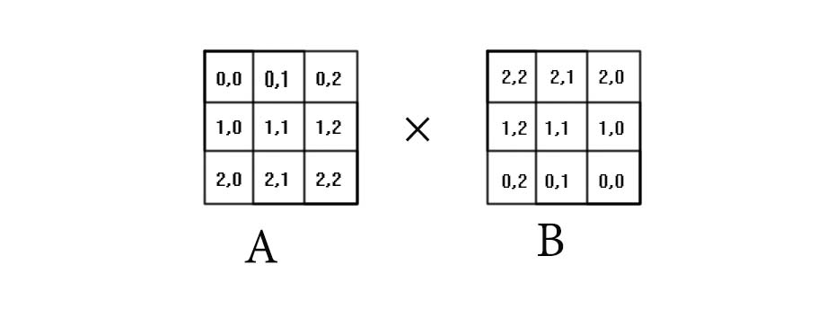

# 卷积定义

$$C(n1,n2)=\sum_{k_{1}=-∞}^{+∞}\sum_{k_{2}=-∞}^{+∞}A(k_{1},k_{2})B(n_{1}-k_{1},n_{2}-k_{2})$$

其中a是源输入，b可以看做一个kernel。
# 卷积操作演示--类似FIR类型
为了简化计算，假设我们有一副随机的3*3的单色图像A：
$$
A=\left\{
   \begin{matrix}
   3 & 6 & 9\\
   7 & 3 & 6\\
   5 & 4 & 1
   \end{matrix}
   \right\}
$$
相对应的我们也有一个kernel也是3*3矩阵,锚点设在中心位置：
$$
B=\left\{
   \begin{matrix}
   -1 & -1 & -1\\
   -1 &  8 & -1\\
   -1 & -1 & -1
   \end{matrix}
   \right\}
$$
那么根据卷积的定义，最终得到的C输出矩阵是一个5*5的矩阵：
$$
C=\left\{
   \begin{matrix}
   c_{(0,0)} & c_{(0,1)} & c_{(0,2)} & c_{(0,3)} & c_{(0,4)}\\
   c_{(1,0)} & c_{(1,1)} & c_{(1,2)} & c_{(1,3)} & c_{(1,4)}\\
   c_{(2,0)} & c_{(2,1)} & c_{(2,2)} & c_{(2,3)} & c_{(2,4)}\\
   c_{(3,0)} & c_{(3,1)} & c_{(3,2)} & c_{(3,3)} & c_{(3,4)}\\
   c_{(4,0)} & c_{(4,1)} & c_{(4,2)} & c_{(4,3)} & c_{(4,4)}\\
   \end{matrix}
   \right\}
$$

因此我们限定了$n_{1},n_{2}∈(0,4),k_{1},k_{2}∈(0,2)$
$$C(n1,n2)=\sum_{k_{1}=0}^{2}\sum_{k_{2}=0}^{2}A(k_{1},k_{2})B(n_{1}-k_{1},n_{2}-k_{2})$$
由于kernel是要遍历整个图像的每个像素，意味着除了中心位置的输出都会被抛弃，FIR关注的是中心点的输出$c_{(2,2)}$:
$$
c_{(2,2)}=
a_{(0,0)}b_{(2,2)}+a_{(0,1)}b_{(2,1)}+a_{(0,2)}b_{(2,0)}+a_{(1,0)}b_{(1,2)}+a_{(1,1)}b_{(1,1)}
+a_{(2,0)}b_{(0,2)}+a_{(2,1)}b_{(0,1)}+a_{(2,2)}b_{(0,0)}
$$
看到没？这个值的运算是把矩阵B翻转180°然后和矩阵A对应位置的元素分别相乘然后相加：

由此，我们得到A矩阵的中心位置$a_{(1,1)}$经过卷积计算后对应的$c_{(2,2)}$的值是-17。说明和周围像素是有反差的，并且是比周围像素要暗。
# kernel的位置分布和权重
上面提到的kernel是这个样子：
$$
B=\left\{
   \begin{matrix}
   -1 & -1 & -1\\
   -1 &  8 & -1\\
   -1 & -1 & -1
   \end{matrix}
   \right\}
$$
假如A图像的像素全部一样：
$$A=\left\{
   \begin{matrix}
   3 & 3 & 3\\
   3 & 3 & 3\\
   3 & 3 & 3
   \end{matrix}
   \right\}
$$
那么通常我们认为这种图像经过卷积后中心点的输出等于0；有了这个限制，kernel的权重分布需要遵循规律：
$$
B=\left\{
   \begin{matrix}
   b_{(0,0)} &  b_{(0,1)} &  b_{(0,2)}\\
   b_{(1,0)} &  b_{(1,1)} &  b_{(1,2)}\\
   b_{(2,0)} &  b_{(2,1)} &  b_{(2,2)}
   \end{matrix}
   \right\}
$$
9个权重，$b_{(0,0)},b_{(0,2)},b_{(2,0)}, b_{(2,2)}$这4个点相对中心锚点距离是相同的，$b_{(0,1)},b_{(1,0)},b_{(1,2)},b_{(2,1)}$这4个点相对中心锚点位置也是相同的，剩下一个锚点，所以遵循的规律就是：
$$4*W_{1}+4*W_{2}+1*W_{3}=0$$