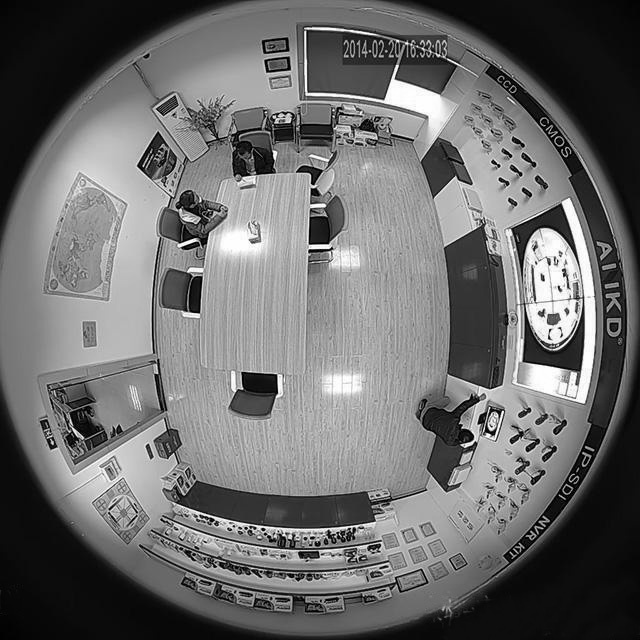
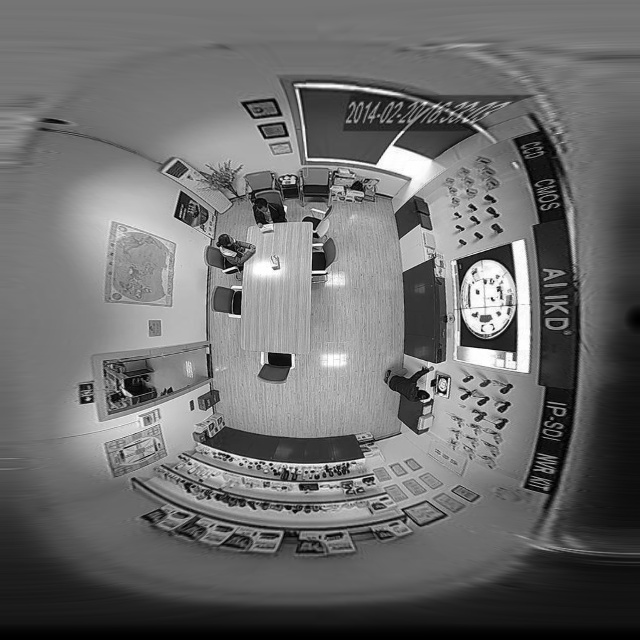

# 计算公式
使用反向映射，避免插值的麻烦。所谓的反向映射，就是说给定结果图像上任一点的坐标，反推畸变矫正前的坐标；
给定结果输出图像（正方形，边长$2R$）上任一点坐标$(x,y)$，首先要推导该点在球（半径$R$）面上的位置，即经度和纬度$(α，β)$，接下来把半球投影到平面上即得到$(x^{'},y^{'})$；
1. $(x,y)$等比放大$π/2$倍
2. 纬度$β=(πy)/2R$
3. 经度$α=(πx)/2R$
4. 矫正前$x^{'}=R-R*sinβ*cosα$
5. 矫正前$y^{'}=R-R*cosβ$

# sample
```c++
#include <iostream>
#include <cmath>
#include <opencv2\opencv.hpp>

using namespace std;
using namespace cv;

#define CV_OPEN_FILE_FAIL -1
#define CV_PARAM_NUM_ERROR -2
#define SHOW_RESULT
#define SAVE_OUTPUT
int main(int argc, char* argv[])
{
	if (argc != 3)
	{
		cout << "==============user guide===============" << endl;
		cout << "argc should be 2 , argv[1] is the source image file name" << endl;
		cout << "argv[2] is name of output image file" << endl;
		cout << "==============end======================" << endl;
		return CV_PARAM_NUM_ERROR;
	}
	
	Mat inputMat = imread(argv[1]);//打开输入图像
	if (inputMat.data == NULL)
	{
		return CV_OPEN_FILE_FAIL;//打开失败
	}
	assert(inputMat.rows==inputMat.cols);//默认保证输入图像长宽一致
	const double PI = 3.14159;
	const int R = inputMat.cols/2;   
	double Latitude, Longitude;
	Mat map1, map2,outputMat;
	map1.create(inputMat.size(), CV_32FC1);//创建x查找表
	map2.create(inputMat.size(), CV_32FC1);//创建y查找表
	outputMat.create(inputMat.size(),inputMat.type());//创建输出
	for (int i = 1; i <= inputMat.rows; i++)//i means y
	{
		float* p1 = map1.ptr<float>(i-1);
		float* p2 = map2.ptr<float>(i-1);
		for (int j = 1; j <= inputMat.cols; j++)// j means x
		{
			Latitude = (PI*i) / (2 * R);
			Longitude = (j*PI) / (2*R);
			p1[j-1] = R*(1 - sin(Latitude)*cos(Longitude));
			p2[j-1] = R*(1 - cos(Latitude));
		}
	}

	remap(inputMat, outputMat, map1, map2, INTER_LINEAR);//根据计算得到的x,y查找表重新映射，得到输出
#ifdef SHOW_RESULT
	namedWindow("display input",CV_WINDOW_AUTOSIZE);
	imshow("display input",inputMat);
	namedWindow("display result", CV_WINDOW_AUTOSIZE);
	imshow("display result", outputMat);
#endif
#ifdef SAVE_OUTPUT
	imwrite(argv[2],outputMat);
#endif
	waitKey();
	return 0;
}
```

# result


因为没有仔细去切割有效圆，所以底部看到了很多黑色无效像素，就是南极点拉的。如何进行精细判定成像圆的范围：
遍历所有的横线与竖线，一旦发生至少一次亮度变化，则该直线判定为有效。