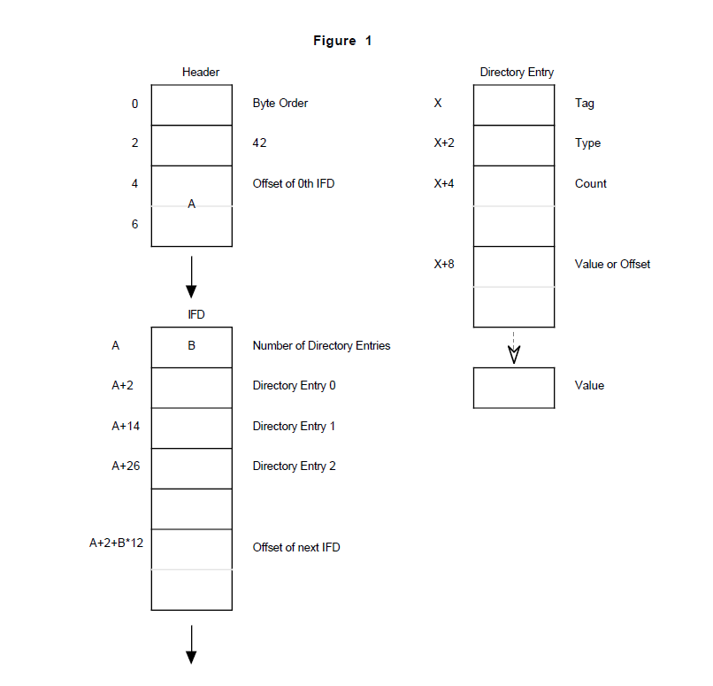

# **section 2 :TIFF struct**
---------
　　TIFF作为一种图片文件格式，in this document，该种文件被看做一个一个字节队列。字节序号从0到N ，理论上最大的TIFF文件是2^32次方字节。
　　TIFF从一个8字节image file header(IFH)起始，指向一段image file director(IFD)。IFD包含了图像的数据区，也就是说，IFH指针指向这片数据区。 
　　
## **image file header - - - - -IFH**
* 字节0-1
标识了字节顺序，有两种顺序，分别对应"Ⅱ"---(4949.H),和"MM"----(4D4D.H)
第一种是little-endian方式，对于16位或者32位的int类型来说，总是小字节排前面。
第二种是big-endian，和第一种相反。

* 字节2-3
必须是是数字42 ，字节顺序依赖字节0-1的值。

* 字节4-7
标识了第一个IFD的偏移量（文件offset）。IFD可以从图像文件的任意位置起始，但必须是从偶数字节开始。reader必须自己跟踪这个起始位置。
byte offset经常用来标识当前位置距离TIFF文件开始位置的偏移量。TIFF文件的第一个字节的byte offset是0.

 
 
## **image file directory  - - - - IFD**
　　IFD首先用2个字节标记包含多少个 directory entry,然后跟着一队12字节的的directory entry，最后是4个字节标记下一个IFD的offset，如果只有一个IFD，则标记为0.
　　所有的TIFF至少包含一个IFD，IFD至少包含一个entry。
### IFD entry
每个12字节的entry包含如下信息：

 1.  字节0-1：标记field的标签
 2.  字节2-3：field的数据类型
 3.  字节4-7：field包含指定类型数据的数量
 4.  字节8-11：field区域的文件偏移量（字节数），起始位置偏移量必须是偶数，offset从0 开始记。
### TIFF field & IFD entry
TIFF field ：一个逻辑实体，包含了tag和其他value
在大部分文章里，这两个词可互换。
### sort order
IFD的entry必须按照entry的tag升序排列 
### value  &  offset
当directory entry最后4个字节能容纳下value时，直接存储，而不是存储value的offset，低于4个字节，则在低位存储value。4个字节能否容纳取决于field的数据类型和 field  count。
### count
count标识了field包含多少个value，而不是多少字节。
### type
可以取1-5
1 = BYTE   8-bit unsigned integer.
2 = ASCII  8-bit byte that contains a 7-bit ASCII code; the last byte must be NUL (binary zero).用NUL结束字符串
3 = SHORT  16-bit (2-byte) unsigned integer.
4 = LONG   32-bit (4-byte) unsigned integer.
5 = RATIONAL Two LONGs: the first represents the numerator of a fraction; the second, the denominator.

当类型是ASCII时，可以包含多个字符串，每个字符串以nul结束，虽然推荐使用单个字符串，这个时候count标识所有字符串包括nul所占用的字节数量。字符串之间只允许一个NUL。

由于TIFF包含不止一种数据类型，所有，阅读软件必须检查field 数据类型以获取预期的数据。比如image width  height 经常被定义成short类型，但在超过64K行或者列时，则必须使用LONG。

TIFF6.0同时引入了如下新类型：
6 = SBYTE 　　　 　An 8-bit signed (twos-complement) integer.
7 = UNDEFINED　　An 8-bit byte that may contain anything, depending on the definition of the field.
8 = SSHORT      　　　 A 16-bit (2-byte) signed (twos-complement) integer.
9 = SLONG       　　　 　A 32-bit (4-byte) signed (twos-complement) integer.
10 = SRATIONAL   　　　Two SLONG’s: the first represents the numerator of a fraction, the second the denominator.
11 = FLOAT       　　　　　Single precision (4-byte) IEEE format.
12 = DOUBLE     　　　　 Double precision (8-byte) IEEE format.

新类型的字节顺序仍然受TFII header tag控制（II OR  MM）

### field are array
每个TIFF都有一个关联的count，也就是说每个field如果vaule存储的是offset，则value都是一维数组。尽管大部分的field的count=1.

## **TIFF包含多个图像**

TIFF可能会包含不止一个IFD ，每个IFD定义了一个子文件，对于baseline-TIFF reader，不要求读取多个IFD。

# **section 3: Bilevel Images双色图像**
------------------------
## **color**
### photomatricinterpretation
Tag = 262 (106.H)
Type = SHORT
Values:
0 = WhiteIsZero. 对于双色图和灰阶图: 0 表示白色. 最大值表示黑色. 
　　This is the normal value for Compression=2.
1 = BlackIsZero. 对于双色图和灰阶图: 0 表示黑色. 最大值表示白色.
　　The maximum value is imaged as white. If this value is specified for Compression=2, theimage should display and print 　　reversed.
## **Compression**
### Compression
Tag = 259 (103.H)
Type = SHORT
Values:
1 = No compression,数据排列尽可能的紧凑,丢弃没用的字节(除非是行末用于凑整).所有的元素按照BYTE数组进行排列，每一行
　　紧接着上一行末尾。
2 = CCITT Group 3 1-Dimensional Modified Huffman run length encoding. 详情请参看section 10.

32773 = PackBits compression, a simple byte-oriented run length scheme. See the PackBits section for details.
　　数据压缩仅仅针对光栅图像数据区，其他的field并不会做压缩
## **Rows and Columns**
### ImageLength
Tag = 257 (101.H)
Type = SHORT or LONG
图像行数
### ImageWidth
Tag = 256 (100.H)
Type = SHORT or LONG
图像列数
## **Physical Dimensions**
### ResolutionUnit
Tag = 296 (128.H)
Type = SHORT
Values:
1 = 没有绝对的测量单位，比如图像不是方形
2 = Inch.英寸
3 = Centimeter.厘米
默认采用2  （Inch）
### XResolution
Tag = 282 (11A.H)
Type = RATIONAL
每个ResolutionUnit具有的像素数量，通常是水平方向。
### YResolution
Tag = 283 (11B.H)
Type = RATIONAL
每个ResolutionUnit具有的像素数量，通常是竖直方向。

## **location of data**
　　压缩或者非压缩的数据可以存储在文件的任何位置，TIFF支持把数据分割成若干个块，来提高存储的灵活性和I/O buffer效率。每个块的文件位置由以下几个tag决定：
### RowsPerStrip
Tag = 278 (116.H)
Type = SHORT or LONG
每块包含的行数，最末尾的块除外（因为不一定能凑齐）
举个例子，如果ImageLength=24,每块包含10行，则需要3个块来存储，前2个块都各自有10行，第三块有4行，然后用6行空数据填充。
### StripOffsets
Tag = 273 (111.H)
Type = SHORT or LONG
For each strip, the byte offset of that strip.
每个strip的的存储起始位置，通常是offset0 ,offset1,offset2,................
### StripByteCounts
Tag = 279 (117.H)
Type = SHORT or LONG
For each strip, the number of bytes in that strip after any compression.
每个strip的存储字节数。（压缩后的）
### 一个简单Bilevel Images实例
Header:
|字节序|含义         | value     |
|----  |:---------:  |----------:|
| 0000 | Byte Order  | 　　　4D4D|
| 0002 | 42 　　　　 |　　　002A|
|0004 |1st IFD offset| 　　00000014|
IFD:
|字节序|含义         | value 依次是tag ,type,count,offset    |
|----  |:---------:  |----------:|
|0014 |Number of Directory Entries 　|000C
|0016 |　NewSubfileType 　　　　　　 |00FE　0004　00000001　00000000
|0022　| ImageWidth 　　　　　　　　 |0100　0004　00000001　000007D0
|002E　 |ImageLength 　　　　　　　　|0101　0004　00000001　00000BB8
|003A 　|Compression 　　　　　　　　|0103　0003　00000001　8005 0000
|0046　|PhotometricInterpretation 　 |0106　0003　00000001　0001 0000
|0052 　|StripOffsets                |0111　0004　000000BC　000000B6
|005E 　|RowsPerStrip                |0116　0004　00000001　00000010
|006A 　|StripByteCounts             |0117　0003　000000BC　000003A6
|0076 　|XResolution                 |011A　0005　00000001　00000696
|0082 　|YResolution                 |011B　0005　00000001　0000069E
|008E 　|Software                    |0131　0002　0000000E　000006A6
|009A 　|DateTime                    |0132　0002　00000014　000006B6
|00A6　 |Next IFD offset             |00000000
Values longer than 4 bytes:
|offset|含义       |内容|
|----  |:-----------:|-------:|
|00B6 |StripOffsets| Offset0, Offset1, ... Offset187
|03A6 |StripByteCounts| Count0, Count1, ... Count187
|0696 |XResolution |0000012C 00000001
|069E |YResolution |0000012C 00000001
|06A6 |Software |“PageMaker 4.0”
|06B6 |DateTime |“1988:02:18 13:59:59”
Image Data:
|strip-offset|内容       |
|----  |----------:|
|00000700 |Compressed data for strip 10
|xxxxxxxx |Compressed data for strip 179
|xxxxxxxx |Compressed data for strip 53
|xxxxxxxx |Compressed data for strip 160
|.....|........

### 关于Bilevel Image Example
* IFD从14字节开始，通常来说，IFD可以从任何位置起始，但必须大于8，因为header占据了开头的8个字节；
* 每个strip有16行，总共188行；
* 该示例使用了一些可选的filed比如DateTime灯，如果reader不知道该tag的含义，可以跳过，baseline Tiff不强制读取这些tag；
* 为了展示TIFF的用法，该示例的date区是高度碎片化的，并不是连续存储；这个例子要说明的是stripoffset千万不要忽略。
### Bilevel Image 必需的filed
|TagName |Decimal| Hex |Type |Value|
|-------|:--------:|:----:|:------:|----:|
|ImageWidth| 256 |100 |SHORT or LONG|
|ImageLength |257 |101 |SHORT or LONG|
|Compression| 259 |103 |SHORT |1, 2 or 32773
|PhotometricInterpretation |262| 106| SHORT| 0 or 1
|StripOffsets| 273 |111 |SHORT or LONG
|RowsPerStrip| 278| 116| SHORT or LONG
|StripByteCounts| 279| 117 |LONG or SHORT
|XResolution| 282| 11A| RATIONAL
|YResolution |283 |11B| RATIONAL
|ResolutionUnit| 296| 128| SHORT |1, 2 or 3
你可以看到前面这个例子省略了上表中的一些filed，这是因为这些被省略的filed有默认值，并且这些默认值适合这个示例。

