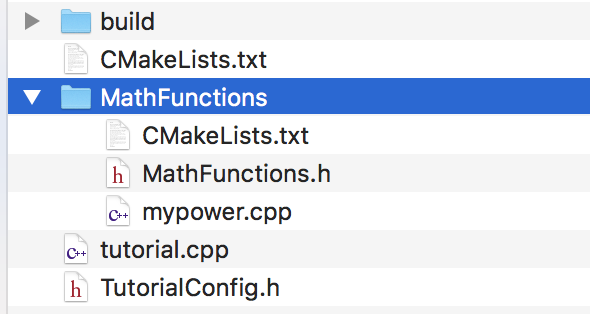
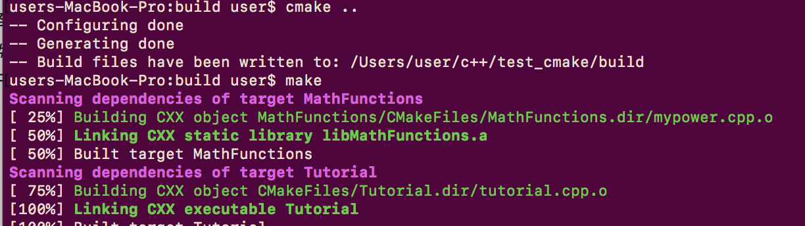

有一个这样的工程：

tutorial.cpp需要编译为可执行文件，代码内部include了TutorialConfig.h和MathFunctions文件夹内的MathFunctions.h;mypower.cpp需要编译成静态lib,并且在需要链接到可执行文件。

首先是主目录下的CMakeLists.txt
```
cmake_minimum_required (VERSION 2.6)
project (Tutorial)
include_directories("${PROJECT_BINARY_DIR}")#为了include TutorialConfig.h
include_directories ("${PROJECT_SOURCE_DIR}/MathFunctions")#include MathFunctions.h
add_subdirectory (MathFunctions) #编译子文件夹，查找子文件夹内的CMakeLists.txt
add_executable(Tutorial tutorial.cxx)# 编译主文件
target_link_libraries (Tutorial  MathFunctions)#链接lib
```
MathFunctions文件夹内的CMakeLists.txt
```
add_library(MathFunctions mysqrt.cxx)
```
新建build文件夹，cd进入


# opencv
对于opencv这样的安装到/usr/local/include /usr/local/lib 的框架来说，需要指定头文件和lib路径
```
cmake_minimum_required(VERSION 2.8)
project( DisplayImage )
find_package( OpenCV REQUIRED )
include_directories( ${OpenCV_INCLUDE_DIRS} )
add_executable( DisplayImage DisplayImage.cpp )
target_link_libraries( DisplayImage ${OpenCV_LIBS} )
```
