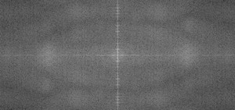
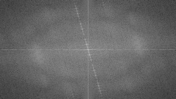

# **goal**
解读如下问题：

* 什么是傅里叶变化，为什么要使用它？
* 如何用opencv实现傅里叶变换？
* 函数用法: `copyMakeBorder()`, `merge()`, `dft()`, `getOptimalDFTSize()`, `log()` and `normalize()` 。

# **source code**
傅里叶变换函数 ：`DFT()`
```c++
    #include "opencv2/core/core.hpp"
    #include "opencv2/imgproc/imgproc.hpp"
    #include "opencv2/highgui/highgui.hpp"
    #include <iostream>
    int main(int argc, char ** argv)
    {
        const char* filename = argc >=2 ? argv[1] : "lena.jpg";
    
        Mat I = imread(filename, CV_LOAD_IMAGE_GRAYSCALE);
        if( I.empty())
            return -1;
    
        Mat padded;                            //新建这个mat对象用于存储扩展后的图像
        int m = getOptimalDFTSize( I.rows );
        int n = getOptimalDFTSize( I.cols ); //获取最优化的用于傅里叶变换的长，宽
        copyMakeBorder(I, padded, 0, m - I.rows, 0, n - I.cols, BORDER_CONSTANT, Scalar::all(0));  
        //扩展，边界全都设成0
    
        Mat planes[] = {Mat_<float>(padded), Mat::zeros(padded.size(), CV_32F)};  
        //为了存储变换后的图像，mat对象int类型 扩展成float类型
        Mat complexI;
        merge(planes, 2, complexI);         // complexI存储planes[0]和planes[1]的合并输出
    
        dft(complexI, complexI);            // 用傅里叶变换输出覆盖掉输入 ，都存储在mat 对象complexI里
    
        // compute the magnitude and switch to logarithmic scale
        // => log(1 + sqrt(Re(DFT(I))^2 + Im(DFT(I))^2))
        split(complexI, planes);                   
        //分解变换后的complexI, planes[0] = Re(DFT(I),即实部 planes[1] = Im(DFT(I))虚部
        magnitude(planes[0], planes[1], planes[0]);// planes[0] = magnitude
        Mat magI = planes[0];
    
        magI += Scalar::all(1);                    // 为了方便显示，采用取对数方法缩减值范围
        log(magI, magI);
    
        // crop the spectrum, if it has an odd number of rows or columns//裁剪频谱，如果有奇数个行或列
        magI = magI(Rect(0, 0, magI.cols & -2, magI.rows & -2));
    
        // rearrange the quadrants of Fourier image  so that the origin is at the image center
        //平移频谱图，把输出起点放在图像中央
        int cx = magI.cols/2;
        int cy = magI.rows/2;
    
        Mat q0(magI, Rect(0, 0, cx, cy));   // Top-Left - Create a ROI per quadrant
        Mat q1(magI, Rect(cx, 0, cx, cy));  // Top-Right
        Mat q2(magI, Rect(0, cy, cx, cy));  // Bottom-Left
        Mat q3(magI, Rect(cx, cy, cx, cy)); // Bottom-Right
    
        Mat tmp;                           // 左上和右下交换位置
        q0.copyTo(tmp);
        q3.copyTo(q0);
        tmp.copyTo(q3);
    
        q1.copyTo(tmp);                    // 右上和左下交换位置
        q2.copyTo(q1);
        tmp.copyTo(q2);
    
        normalize(magI, magI, 0, 1, CV_MINMAX); // Transform the matrix with float values into a
                                                // viewable image form (float between values 0 and 1).
     //线性化，float下，显示范围是0-1，振幅分量的值仍然超出了这个范围
        imshow("Input Image"       , I   );    // Show the result
        imshow("spectrum magnitude", magI);
        waitKey();
    
        return 0;
    }
```    
# **explanation**

傅里叶变换可以把一副图形从时域转换到频域，任何函数都可以用无穷多的正弦和余弦函数组合逼近。数学上的二维傅里叶变换：
$$ F(k,l)=\sum_{i=0}^{N-1}\sum_{j=0}^{N-1}f(i,j)e^{-i2\pi(\frac{ki}{N}+\frac{kj}{N})}$$
$$ e^{ix}=cos x+i sinx$$
F(k,l)是表示频域的函数，f(i,j)是时域的函数，转换结果是一个复数，可以通过实部和虚部，或者振幅和相位来显示这个结果，一般的，振幅分量即包含我们想得到的几何信息，如果你还需要逆变换回去，你仍然需要保留相位分量。
# **test**
如下是一张文字照片经傅里叶变换后的形态：

 
 
旋转后：


可以看到，转换后的分布和旋转是一致的。