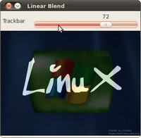

# 关于滚动条
--------------------
* 在之前的章节里，你可能注意到了有些函数的参数是通过终端输入的，比如在对比度章节里： $\alpha$ 和 $\beta$.

* 是时候使用一些漂亮的 GUI 控件了. OpenCV 提供了一些GUI 实用工具 (highgui.h) . 比如滚动条；

* 滚动条实例：
本节我们将修改之前的章节中的例子来通过滚动条接收输入信息 。
## Goals

* 在opencv的GUI窗口添加一个滚动条： 使用函数` createTrackbar()`
## Code
修改教程： [Adding (blending) two images using OpenCV](http://docs.opencv.org/2.4.11/doc/tutorials/core/adding_images/adding_images.html#adding-images). 用户将通过滚动滚动条来输入$\alpha$ 
```c++
#include <cv.h>
#include <highgui.h>

using namespace cv;

/// 全局变量
const int alpha_slider_max = 100;
int alpha_slider;
double alpha;
double beta;


Mat src1;  //src1 src2存储2个输入图像，然后把混合结果放在dst
Mat src2;
Mat dst;

/**
 * @function on_trackbar
 * @brief Callback for trackbar
 */
void on_trackbar( int, void* )
{
 alpha = (double) alpha_slider/alpha_slider_max ;
 beta = ( 1.0 - alpha );

 addWeighted( src1, alpha, src2, beta, 0.0, dst);

 imshow( "Linear Blend", dst );
}

int main( int argc, char** argv )
{
 /// Read image ( same size, same type )
 src1 = imread("../../images/LinuxLogo.jpg");
 src2 = imread("../../images/WindowsLogo.jpg");

 if( !src1.data ) { printf("Error loading src1 \n"); return -1; }
 if( !src2.data ) { printf("Error loading src2 \n"); return -1; }

 /// Initialize values
 alpha_slider = 0;

 /// Create Windows
 namedWindow("Linear Blend", 1);

 /// Create Trackbars
 char TrackbarName[50];
 sprintf( TrackbarName, "Alpha x %d", alpha_slider_max );

 createTrackbar( TrackbarName, "Linear Blend", &alpha_slider, alpha_slider_max, on_trackbar );

 /// Show some stuff
 on_trackbar( alpha_slider, 0 );

 /// Wait until user press some key
 waitKey(0);
 return 0;
}
```

#explanation
1. 加载2幅图像，用于混合.

        src1 = imread("../../images/LinuxLogo.jpg");
        src2 = imread("../../images/WindowsLogo.jpg");
2. 创建滚动条之前，首先创建一个窗口:

        namedWindow("Linear Blend", 1);
3. 创建滚动条:

        createTrackbar( TrackbarName, "Linear Blend", &alpha_slider, alpha_slider_max, on_trackbar );
 参数列表:

* 滚动条标签 **TrackbarName**
* 滚动条是创建在窗口： “Linear Blend”
* 滚动条的值范围 0 - alpha_slider_max (最小值通常是 0).
* 滚动条变量控制的是：alpha_slider
* 当滚动条有变化，函数：`on_trackbar` 被调用
4. 定义被调用函数

        void on_trackbar( int, void* )
        {
         alpha = (double) alpha_slider/alpha_slider_max ;
        beta = ( 1.0 - alpha );

        addWeighted( src1, alpha, src2, beta, 0.0, dst);

        imshow( "Linear Blend", dst );
        }
## result
