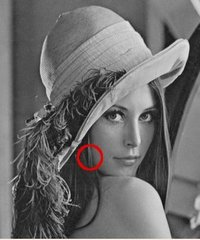
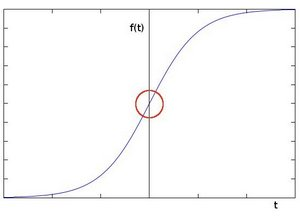
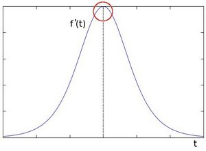
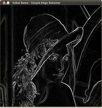

# **goal**
本节学习：

* 使用opencv函数`Soble()`计算pixle的导数；
* 使用opencv函数`Scharr()`对 $3 \cdot 3$矩阵计算更精确的导数；

# **Theory**

1. 之前两节我们运用到了卷积的一些示例，一个很重要的卷积是计算图像上像素的导数；

2. 为什么计算导数很重要呢？如果你想检测图像上的边缘，比如：

你可以看到，在边缘部分，像素密度会有一个陡变。导数能够很好的描述这种变化趋势。

1. 为了更加直观些，假设我们有一个一维的图像，那么边缘部分的像素值就会像下图那样有一个比较剧烈的变化：
 
2. 边缘的像素值变化可以通过计算一阶导数看的更清楚：
 
3. 通过以上的介绍，我们可以想到一种检测边缘的方法：计算导数，获取梯度大于周边像素（或者大于某个thresold）的像素，即把这些像素判定为边缘；
## Sobel Operator
* Soble操作是一种离散变种操作，它计算图像像素值变化函数的近似梯度；
* Soble操作包含了高斯模糊及其变种；
## 公式
设想一下，要计算的图像是I：
我们计算2个方向上的导数：
水平变化：用I 和一个大小为奇数的kernel进行卷积得到 $G_{x}$，比如大小为3的kernel:

$$G_{x} = \begin{bmatrix}
-1 & 0 & +1  \\
-2 & 0 & +2  \\
-1 & 0 & +1   
\end{bmatrix} * I$$

数值变化: 用I 和一个大小为奇数的kernel 进行卷积得到 $G_{y}$，比如大小为3的kernel:

$$G_{y} = \begin{bmatrix}
-1 & -2 & -1  \\
0 & 0 & 0  \\
+1 & +2 & +1
\end{bmatrix} * I$$

综合两个方向，我们得到该点最终的梯度为：
$$G = \sqrt{ G_{x}^{2} + G_{y}^{2} }$$

但有时候，为了简化运算也会写作：

$$G = |G_{x}| + |G_{y}|$$

>小贴士：
当kernel的大小为3时，上述的Sobel kernel可能会导致较大的误差（毕竟，这是一种近似导数计算）. OpenCV 使用函数`Scharr()`消减这种$3\cdot3$kernel的误差.这个函数也很快，精度比标准的soble函数要高. 它使用如下 kernels:

>$$G_{x} = \begin{bmatrix}
-3 & 0 & +3  \\
-10 & 0 & +10  \\
-3 & 0 & +3
\end{bmatrix}$$

>$$G_{y} = \begin{bmatrix}
-3 & -10 & -3  \\
0 & 0 & 0  \\
+3 & +10 & +3
\end{bmatrix}$$
# **code**
1. 这个程序做什么？
* 应用Sobel Operator并产生一幅输出图像，明亮部分表示边界，暗部则不是;

2. code
```c++
#include "opencv2/imgproc/imgproc.hpp"
#include "opencv2/highgui/highgui.hpp"
#include <stdlib.h>
#include <stdio.h>

using namespace cv;

/** @function main */
int main( int argc, char** argv )
{

  Mat src, src_gray;
  Mat grad;
  char* window_name = "Sobel Demo - Simple Edge Detector";
  int scale = 1;
  int delta = 0;
  int ddepth = CV_16S;

  int c;

  /// Load an image
  src = imread( argv[1] );

  if( !src.data )
  { return -1; }

  GaussianBlur( src, src, Size(3,3), 0, 0, BORDER_DEFAULT );

  /// Convert it to gray
  cvtColor( src, src_gray, CV_RGB2GRAY );

  /// Create window
  namedWindow( window_name, CV_WINDOW_AUTOSIZE );

  /// Generate grad_x and grad_y
  Mat grad_x, grad_y;
  Mat abs_grad_x, abs_grad_y;

  /// Gradient X
  //Scharr( src_gray, grad_x, ddepth, 1, 0, scale, delta, BORDER_DEFAULT );
  Sobel( src_gray, grad_x, ddepth, 1, 0, 3, scale, delta, BORDER_DEFAULT );
  convertScaleAbs( grad_x, abs_grad_x );

  /// Gradient Y
  //Scharr( src_gray, grad_y, ddepth, 0, 1, scale, delta, BORDER_DEFAULT );
  Sobel( src_gray, grad_y, ddepth, 0, 1, 3, scale, delta, BORDER_DEFAULT );
  convertScaleAbs( grad_y, abs_grad_y );

  /// Total Gradient (approximate)
  addWeighted( abs_grad_x, 0.5, abs_grad_y, 0.5, 0, grad );

  imshow( window_name, grad );

  waitKey(0);

  return 0;
  }
```
# explanation
1. 首先应用高斯模糊减小噪点( kernel size = 3 )；
```c++
        GaussianBlur( src, src, Size(3,3), 0, 0, BORDER_DEFAULT );
```
2. 转换成灰度:
```c++
        cvtColor( src, src_gray, CV_RGB2GRAY );
```
3. 分别计算水平和竖直方向的梯度.使用函数`Sobel()` as shown below:
```c++
        Mat grad_x, grad_y;
        Mat abs_grad_x, abs_grad_y;
        Sobel( src_gray, grad_x, ddepth, 1, 0, 3, scale, delta, BORDER_DEFAULT );
        Sobel( src_gray, grad_y, ddepth, 0, 1, 3, scale, delta, BORDER_DEFAULT );
```
     参数解释：

     - src_gray:输入图像，这个例子中我们做了灰度转换，mat.depth== CV_8U
     - grad_x/grad_y: 输出图像；
     - ddepth: 输出图像的位深度. 设成CV_16S避免溢出；
     - x_order: x方向导数的阶次；
     - y_order: y方向导数的阶次；
     - scale, delta and BORDER_DEFAULT: We use default values.

4. 把2个局部结果转换回 CV_8U:
```c++
convertScaleAbs( grad_x, abs_grad_x );
convertScaleAbs( grad_y, abs_grad_y );
```
5. 最后，把两个分量进行合并叠加；（注意，这并不是一个精确的方法，但是针对这个例子而言足够了）
```c++
addWeighted( abs_grad_x, 0.5, abs_grad_y, 0.5, 0, grad );
```
# result
