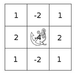
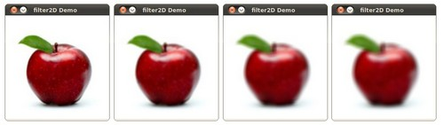

# 本节目的
* 学会使用`filter2D()`自定义线型filter;
# 理论知识
## 卷积
* 通俗来讲，卷积是一种用图像快（矩阵形式）与kernel矩阵进行运算的一种操作；
## 什么是kernel
kernel本质上是一个拥有一个锚点的固定大小的矩阵，锚点通常位于中心位置：

## 与一个kernel进行卷积是如何进行的？

假设你想知道图像上某一个点的卷积结果，计算过程如下：
1. 把锚点放在你想知道卷积结果的点上，kernel的其他部分覆盖在对应的图像上；
2. 所有被覆盖的点一一对应相乘，并把所有相乘的结果相加；
3. 把相加的结果放在锚点覆盖的点；
4. 重复如上过程，计算其他所有的点；
数学表达式：
$$H(x,y) = \sum_{i=0}^{M_{i} - 1} \sum_{j=0}^{M_{j}-1} I(x+i - a_{i}, y + j - a_{j})K(i,j)$$
幸运的是，opencv提供了函数`filter2D()`,所以你不必重复造轮子；
# code
1. 这个程序做什么？
* 加载图像；
* 执行一个线性 box filter. 作为例子，kernel如下：
$$K = \dfrac{1}{3 \cdot 3} \begin{bmatrix}
1 & 1 & 1 \\ 
1 & 1 & 1 \\
1 & 1 & 1 
\end{bmatrix}$$
这个程序会执行与kernel size=3,5,7,9,11不同的kernel进行卷积；

* 这个filter的输出大约在500毫秒；
2. code如下：

```c++
#include "opencv2/imgproc/imgproc.hpp"
#include "opencv2/highgui/highgui.hpp"
#include <stdlib.h>
#include <stdio.h>

using namespace cv;

/** @function main */
int main ( int argc, char** argv )
{
  /// Declare variables
  Mat src, dst;

  Mat kernel;
  Point anchor;
  double delta;
  int ddepth;
  int kernel_size;
  char* window_name = "filter2D Demo";

  int c;

  /// Load an image
  src = imread( argv[1] );

  if( !src.data )
  { return -1; }

  /// Create window
  namedWindow( window_name, CV_WINDOW_AUTOSIZE );

  /// Initialize arguments for the filter
  anchor = Point( -1, -1 );
  delta = 0;
  ddepth = -1;

  /// Loop - Will filter the image with different kernel sizes each 0.5 seconds
  int ind = 0;
  while( true )
    {
      c = waitKey(500);
      /// Press 'ESC' to exit the program
      if( (char)c == 27 )
        { break; }

      /// Update kernel size for a normalized box filter
      kernel_size = 3 + 2*( ind%5 );
      kernel = Mat::ones( kernel_size, kernel_size, CV_32F )/ (float)(kernel_size*kernel_size);

      /// Apply filter
      filter2D(src, dst, ddepth , kernel, anchor, delta, BORDER_DEFAULT );
      imshow( window_name, dst );
      ind++;
    }

  return 0;
}
```
# explanation
```c++
filter2D(src, dst, ddepth , kernel, anchor, delta, BORDER_DEFAULT );
```
filter2D()有7个参数：

* src: 源图像mat
* dst: 目标输出mat
* ddepth: 目标输出mat的位深度，如果为-1则和源mat的位深度一致；
* kernel: 自定义的kernel（也是mat类型）
* anchor: kernel的锚点位置. The location Point(-1, -1) indicates the center by default.
* delta: 卷积运算过程中被添加在每个pixel上的值，默认为0；
* BORDER_DEFAULT: 指定如何进行边界扩展，因为边界情况比较特殊，需要进行扩展使得kernel每个元素都能覆盖到一个点。
# 结果

