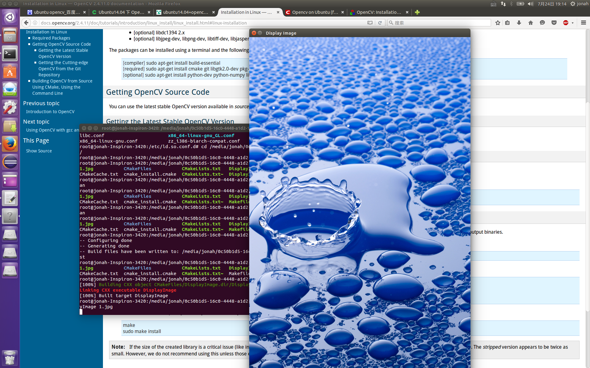

# step
* 下载源码
* 解压后，新建一个目录比如opencv/release
* cd opencv/release/
* cmake-gui启动cmake
* 配置source code目录以及build目录
* 点configure选择参数
* 点generate生成cmakelist
* make -j8
* make install 安装到/usr/local
* make uninstall卸载

-----
注意libgtk2.0-dev的依赖问题，14.04LTS上的libgtk2.0版本是最新的，需要做降级处理
* aptitude install libgtk2.0-dev
* 还有一个namedWindow()函数问题，我也不知道怎么就突然好了，就是重新编译了一下源码

---------

--------
[官方链接](http://docs.opencv.org/3.0.0/d7/d9f/tutorial_linux_install.html)